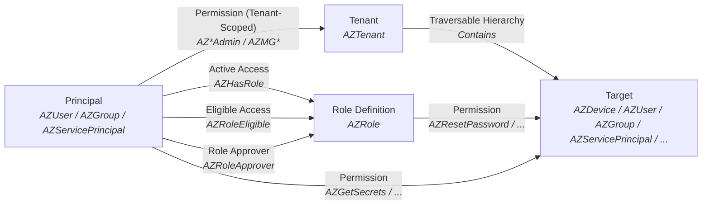
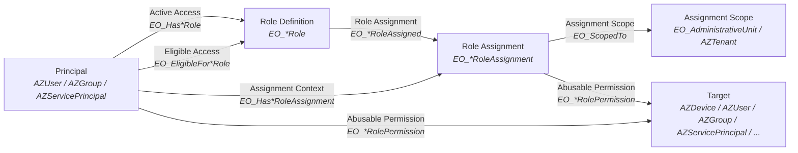
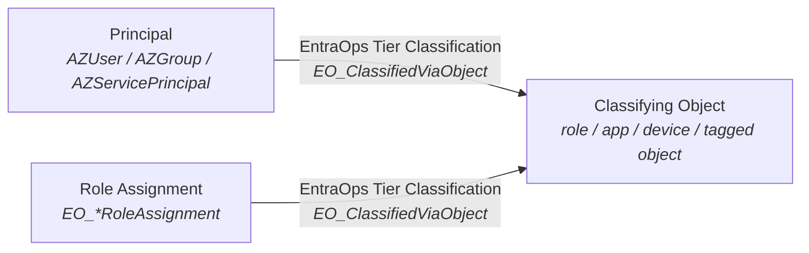

# EntraOps BloodHound Integration

Export EntraOps Privileged EAM data as BloodHound OpenGraph JSON and deploy custom node types to BloodHound CE/Enterprise.

The function `Export-EntraOpsPrivilegedEAMBloodHound` reads the per-RBAC-system EAM export files and converts them into a BloodHound OpenGraph JSON payload.

## Prerequisites

- EntraOps module with EAM export data (produced by `Save-EntraOpsPrivilegedEAMJson`)
- BloodHound CE or Enterprise instance

## Usage

### 1. Collect/upload AzureHound data

Run and ingest the AzureHound collection that the EntraOps data will extend.

Read the BloodHound documentation about [AzureHound Community Edition: Collecting Data with AzureHound](https://bloodhound.specterops.io/collect-data/ce-collection/azurehound#collecting-data-with-azurehound) and ensure you have been granted [the required permissions](https://bloodhound.specterops.io/collect-data/azurehound-data-permissions).

### 2. Generate EntraOps Privileged EAM JSON

Follow the repository-level [EntraOps README](../README.md#executing-entraops-interactively) to connect to the tenant and generate classified Privileged EAM JSON with `Save-EntraOpsPrivilegedEAMJson`. The BloodHound exporter does not calculate EntraOps classification itself; it expects the JSON output to already contain classification data.

By default, the BloodHound exporter's `-ImportPath` parameter uses the EntraOps Privileged EAM output folder, typically `.\PrivilegedEAM`. The exporter reads per-RBAC-system files from that folder, for example `.\PrivilegedEAM\<RbacSystem>\<RbacSystem>.json`. If current classified JSON files already exist there, you can skip this collection step and export OpenGraph data from the existing files.

### 3. Export EntraOps OpenGraph data

Dot-source [Export-EntraOpsPrivilegedEAMBloodHound](/EntraOps/Public/PrivilegedAccess/Export-EntraOpsPrivilegedEAMBloodHound.ps1):

```powershell
. .\EntraOps\Public\PrivilegedAccess\Export-EntraOpsPrivilegedEAMBloodHound.ps1
```

Export to OpenGraph:

```powershell
Export-EntraOpsPrivilegedEAMBloodHound -TenantId "<tenant-id>"
```

The default output path for OpenGraph data is `.\PrivilegedEAM\BloodHound\EntraOps_OpenGraph.json`.

### 4. Upload EntraOps OpenGraph data to BloodHound

Upload the generated `EntraOps_OpenGraph.json` file via the BloodHound CE/Enterprise UI or API.

### 5. Deploy EntraOps Extension Schema

Before or after uploading the exported JSON, deploy the OpenGraph extension schema to BloodHound.

1. Read BloodHound documentation: [Install an extension](https://bloodhound.specterops.io/opengraph/extensions/manage#install-an-extension)
2. Upload the extension definition schema: [OpenGraph_EntraOps_Extension_Schema.json](OpenGraph_EntraOps_Extension_Schema.json)

## Graph Model

The OpenGraph schema is described in [schema.md](schema.md) which references node/edge documentation in the [descriptions](descriptions) directory.

### RBAC model

The EntraOps RBAC model supports Entra ID, Intune, Identity Governance, and app roles. It differs from the current BloodHound RBAC model.

The current BloodHound/AzureHound RBAC model represents effective role access directly between a principal and a role definition:



EntraOps keeps those direct access edges, then adds the concrete role assignment as first-class context. This makes scope, assignment type, PIM state, and permissions visible without replacing the native BloodHound path:




In practice, the EntraOps graph is an overlay on the AzureHound graph. EntraOps-owned kinds use the `EO_` prefix, while Entra ID role definitions and direct principal-to-role relationships keep their BloodHound/AzureHound-native kinds:

| Concept | BloodHound/AzureHound kind | EntraOps context |
|---|---|---|
| Entra ID role definition | `AZRole` | Referenced by `EO_EntraRoleAssigned` from the role definition to the concrete assignment |
| Active Entra ID role assignment | `AZHasRole` | Principal also has `EO_HasEntraRoleAssignment` to an `EO_EntraRoleAssignment` node |
| Eligible Entra ID role assignment | `AZRoleEligible` | Same `EO_EntraRoleAssignment` context, with eligible PIM state preserved in assignment properties |

Those native role nodes and edges are expected to already exist from AzureHound, so EntraOps references them instead of emitting AzureHound scaffolding itself.

AzureHound also creates the principal and group nodes that EntraOps references. EntraOps does not recreate those nodes for nested group paths, but it can add missing `AZMemberOf` edges for PIM-for-Groups eligible memberships that AzureHound does not collect. In the Privileged EAM export, a transitive role assignment with `RoleAssignmentSubType` set to `Eligible member` means the assignment's `ObjectId` is an eligible member of `TransitiveByObjectId`. For nested eligible group paths, EntraOps uses `TransitiveByNestingObjectIds` to add only the eligible group-to-group `AZMemberOf` hops; ordinary permanent or active membership remains AzureHound-owned.

### EntraOps classification model

EntraOps also models why a principal or role assignment received its Enterprise Access Model tier classification by linking it to the object that drove the classification decision:



## Cypher Queries

EntraOps-specific Cypher queries can be used to enhance visibility.

The [EntraOps-queries.json](EntraOps-queries.json) can be [imported in queries.specterops.io](https://queries.specterops.io/?source=https%3A%2F%2Fraw.githubusercontent.com%2FCloud-Architekt%2FEntraOps%2Frefs%2Fheads%2Fmain%2FIntegrations%2FBloodHound%2FEntraOps-queries.json&sourceLabel=EntraOps) or in the BloodHound UI.

### Administrative Units with assigned Tier Zero principals

Show Administrative Units that have assigned Tier Zero principals.

```cypher
MATCH p=(principals:Tag_Tier_Zero)-[:EO_AssignedToAdministrativeUnit]-(au:EO_AdministrativeUnit)
RETURN p
LIMIT 1000
```

### PAWs used by Tier Zero principals

Show Privileged Access Workstation devices used by Tier Zero principals.

```cypher
MATCH p=(principal:Tag_Tier_Zero)-[:EO_UsesPAW|EO_OwnsDevice]->(paw:AZDevice)
RETURN p
LIMIT 1000
```

### Role Assignments that can wipe Intune devices

Display Intune role assignments with permissions to wipe company data from Intune-managed devices. Includes returning the assigned groups & principals and scopes.

```cypher
MATCH p1=(principal)-[:AZMemberOf*1..]->(:AZGroup)-[:EO_HasIntuneRoleAssignment]->(roleAssignment:EO_IntuneRoleAssignment)
WHERE any(action IN roleAssignment.matchedactions WHERE action IN [
        'Microsoft.Intune/RemoteTasks/Wipe',
        'Microsoft.Intune/RemoteTasks/Retire',
        'Microsoft.Intune/RemoteTasks/CleanPC',
        'Microsoft.Intune/ManagedDevices/Delete'
      ])
OPTIONAL MATCH p2=(roleAssignment)-[:EO_ScopedTo]->(scope)
RETURN p1,p2
LIMIT 1000
```

### Principals sponsoring a Tier Zero principal

Show principals that sponsor Tier Zero principals.

```cypher
// EntraOps Classification: Tier Zero
MATCH p=(tierzero:Tag_Tier_Zero)-[:EO_IsSponsoredBy]->(principal)
RETURN p
LIMIT 1000
```

### Nested role assignments

Show role assignments granted to nested groups

```cypher
MATCH p=(group:AZGroup)-[:AZMemberOf*1..]->(:AZGroup)-[:EO_HasIntuneRoleAssignment|EO_HasDefenderRoleAssignment|EO_HasEntraRoleAssignment|EO_HasIdGovRoleAssignment|EO_HasAppRoleAssignment]->(ra)
RETURN p
```

### PIM-for-Groups edges

Show `AZMemberOf` edges that are assigned via PIM-for-Groups.

```cypher
MATCH p=()-[r:AZMemberOf]->(:AZGroup)
WHERE r.pimassignmenttype IS NOT NULL
RETURN p
```

### EntraOps tier classifications

Show EntraOps tier classification edges.

```cypher
MATCH p=()-[:EO_ClassifiedViaObject]->()
RETURN p
```

## Privilege Zone Rules

The following [Privilege Zone or Label rules](https://bloodhound.specterops.io/analyze-data/privilege-zones/rules) can be imported into BloodHound to group nodes for Cypher query analysis and BloodHound Enterprise finding generation.

### EntraOps Classification: Tier Zero

Nodes classified as Tier Zero by EntraOps.

```cypher
MATCH (n)
WHERE 0 IN n.classification_tierlevels
RETURN n
```

### EntraOps Classification: Tier One

Nodes classified as Tier One by EntraOps.

```cypher
MATCH (n)
WHERE 1 IN n.classification_tierlevels
RETURN n
```

### EntraOps Classification: Tier Two

Nodes classified as Tier Two by EntraOps.

```cypher
MATCH (n)
WHERE 2 IN n.classification_tierlevels
RETURN n
```


