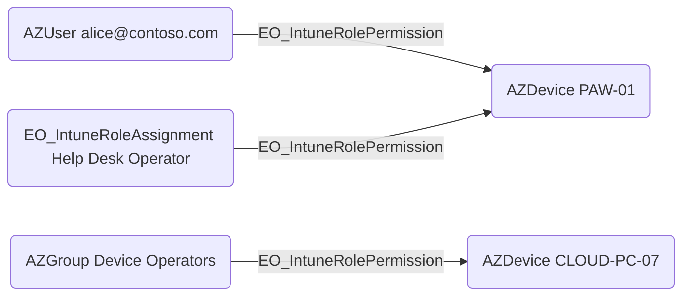

## General Information

The traversable `EO_IntuneRolePermission` edge represents an effective Microsoft Intune / Device Management permission path to an AzureHound device node. EntraOps creates this edge when a DeviceManagement role assignment has classification data with matched Intune actions and scoped devices.

EntraOps emits this edge from the concrete `EO_IntuneRoleAssignment` node to each scoped `AZDevice`, and from the assigned principal to the same `AZDevice`. The principal edge makes the effective device permission directly traversable from the identity or group that received the Intune role assignment. The role-assignment edge preserves the assignment context and the matched `actions` property.

The target `AZDevice` is expected to resolve against an existing AzureHound-ingested device. The edge does not mean that the source principal authenticated to the device directly; it means the source has Intune administrative capability over the device according to the matched role actions and scope.



## Abuse Info

An attacker who controls the source principal can use the underlying Intune role assignment to operate on the target device when the edge's `actions` property contains actions that are useful for device control, policy modification, app deployment, script deployment, device actions, or security configuration changes. The exact abuse path depends on the role definition permissions EntraOps matched for the edge and whether the assignment scope reaches the target device through scope groups, all-device scope, and scope tags.

## Cleanup after Abuse

Clean up the Intune authorization path that produced the edge. The right fix depends on why the source could administer the target device:

- Remove the source user from the group that receives the Intune role assignment.
- Remove the source group from the role assignment's admin groups.
- Narrow the role assignment's scope groups so the target device is no longer in scope.
- Remove or change the target device's scope tags when the tag is the reason the device is visible and manageable.
- Replace an overprivileged custom role with a role that does not include the matched device-management actions.
- Delete the role assignment if it exists only for the test or abuse path.

In the Microsoft Intune admin center, review the assignment under `Tenant administration > Roles > All roles > <role> > Assignments`. Confirm the assignment's admin groups, scope groups, and scope tags. If the target device is tagged, also review the device under `Devices > All devices > <device> > Properties` and verify its scope tags.

Use Microsoft Graph to verify the role assignment before and after cleanup. The token must have Intune RBAC permissions such as `DeviceManagementRBAC.Read.All` for review, or `DeviceManagementRBAC.ReadWrite.All` for changes.

```powershell
$GraphBaseUrl = "https://graph.microsoft.com/v1.0"
$AccessToken = "<access-token>"
$RoleDefinitionId = "<intune-role-definition-id>"
$RoleAssignmentId = "<intune-role-assignment-id>"

$Headers = @{
    Authorization = "Bearer $AccessToken"
    Accept        = "application/json"
}

Invoke-RestMethod `
    -Method Get `
    -Uri "$GraphBaseUrl/deviceManagement/roleDefinitions/$RoleDefinitionId/roleAssignments/$RoleAssignmentId" `
    -Headers $Headers
```

If the assignment should be removed completely, delete it and verify that the API returns no object for the old assignment ID.

```powershell
$WriteHeaders = $Headers + @{
    "Content-Type" = "application/json"
}

Invoke-RestMethod `
    -Method Delete `
    -Uri "$GraphBaseUrl/deviceManagement/roleDefinitions/$RoleDefinitionId/roleAssignments/$RoleAssignmentId" `
    -Headers $WriteHeaders

try {
    Invoke-RestMethod `
        -Method Get `
        -Uri "$GraphBaseUrl/deviceManagement/roleDefinitions/$RoleDefinitionId/roleAssignments/$RoleAssignmentId" `
        -Headers $Headers
} catch {
    $_.Exception.Response.StatusCode.value__
}
```

After cleanup, rerun the EntraOps BloodHound export and confirm the `EO_IntuneRolePermission` edge from the source principal to the target `AZDevice` is gone. If the role assignment edge remains but the principal edge is gone, check whether another assigned principal still has the same role assignment.

## Opsec Considerations

Changes to Intune role assignments, scope groups, scope tags, and device management actions are administrative activity. Intune audit logs record change-generating activity such as create, update, delete, assign, and remote actions. Review `Tenant administration > Audit logs` in the Intune admin center after testing or remediation.

Microsoft Graph can also retrieve Intune audit events. Use broad time-bounded queries first, then filter locally for the role assignment, role name, target device, actor, or operation names shown in your tenant. Avoid assuming that every tenant exposes identical activity strings.

```powershell
$GraphBaseUrl = "https://graph.microsoft.com/v1.0"
$AccessToken = "<access-token>"
$Headers = @{
    Authorization = "Bearer $AccessToken"
    Accept        = "application/json"
}

Invoke-RestMethod `
    -Method Get `
    -Uri "$GraphBaseUrl/deviceManagement/auditEvents?`$top=50" `
    -Headers $Headers
```

Defenders should treat this edge as a review priority when it crosses an Enterprise Access Model tier boundary. A cloud-management path to a privileged workstation can be as important as an interactive session, local admin path, or directory-control path, even if the source identity never logs on to the device.

## References

- [Role-based access control with Microsoft Intune](https://learn.microsoft.com/en-us/intune/intune-service/fundamentals/role-based-access-control)
- [Assign Microsoft Intune roles for role-based access control](https://learn.microsoft.com/en-us/intune/fundamentals/role-based-access-control/assign-role)
- [Use RBAC and scope tags for distributed IT](https://learn.microsoft.com/en-us/intune/intune-service/fundamentals/scope-tags)
- [Microsoft Graph roleAssignment resource type](https://learn.microsoft.com/en-us/graph/api/resources/intune-rbac-roleassignment?view=graph-rest-1.0)
- [Delete roleAssignment](https://learn.microsoft.com/en-us/graph/api/intune-rbac-roleassignment-delete?view=graph-rest-1.0)
- [Use audit logs to track and monitor events in Microsoft Intune](https://learn.microsoft.com/en-us/intune/intune-service/fundamentals/monitor-audit-logs)
- [Microsoft Graph auditEvent resource type](https://learn.microsoft.com/en-us/graph/api/resources/intune-auditing-auditevent?view=graph-rest-1.0)
